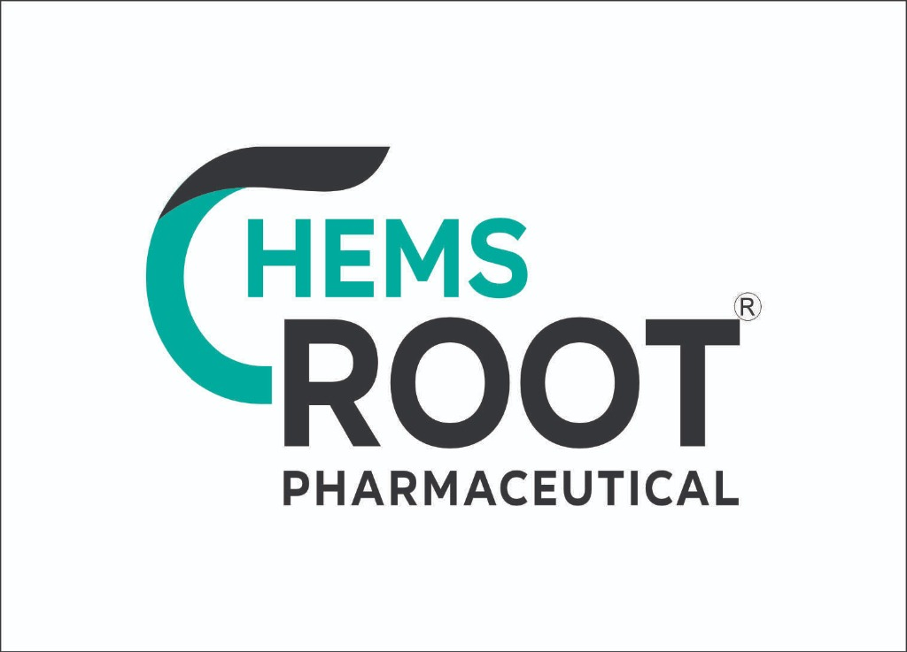

# Chems Root Pharmaceutical — B2B Product Catalog

A professional, feature-rich B2B pharmaceutical product catalog and order management system designed for pharmaceutical distributors and PCD franchises.



## 🌟 Key Features

### 🛒 Catalog & Ordering
- **Dynamic Product Grid**: Clean, professional layout with high-quality product cards.
- **Unit-Based Ordering**: Designed specifically for wholesale—tracks box counts and units instead of retail pricing.
- **Instant Quantity Update**: Adjust quantities directly from the catalog page without opening the cart.
- **Image Zoom**: Click on any product image to see a high-resolution zoomed-in view.
- **Search & Filter**: Powerful search bar combined with category and medical specialty (label) filters.

### 📄 Professional Invoicing
- **Auto-Generated Invoices**: Creates professional, branded PDF-style receipts upon order completion.
- **Visual Receipts**: Uses `html2canvas` to generate shareable `.jpg` images of invoices directly in the browser.
- **WhatsApp Integration**: Share order summaries and invoice details directly to customers via WhatsApp.

### 👤 Customer Dashboard
- **Order History**: Customers can view all their previous orders in a dedicated dashboard.
- **Re-Order / Edit**: Click "Edit" on a past order to instantly reload those items into the cart for quick modification or re-ordering.
- **Secure Phone Login**: Simple, frictionless login using name and mobile number.

### 🛠️ Admin Dashboard
- **Product Management**: Full CRUD (Create, Read, Update, Delete) operations for the entire catalog.
- **Bulk Upload**: Import hundreds of products instantly using CSV bulk upload.
- **Category & Label Management**: Create custom categories and medical specialties on the fly.
- **Order Management**: Track and view all incoming orders from customers.

## 🛠️ Technology Stack
- **Frontend**: HTML5, Vanilla CSS3 (Custom Design System), Modern JavaScript (ES6+).
- **Libraries**: `html2canvas` (for receipt image generation).
- **Storage**: `localStorage` (Browser-based persistence for products and orders).
- **Design**: Premium, responsive UI with smooth transitions and micro-animations.

## 🚀 Getting Started

### Installation
Since this is a purely frontend application, there is no complex installation required.

1. Clone the repository:
   ```bash
   git clone https://github.com/your-username/chems-root-catalog.git
   ```
2. Open `index.html` in any modern web browser.

### Deployment
The application is ready for instant deployment to static hosting platforms:
- **Netlify**: Drag and drop the folder to Netlify Drop.
- **GitHub Pages**: Push the code to a repository and enable Pages in settings.
- **Vercel**: Link your GitHub repository for automatic deployments.

## 🔒 Security Note
This version currently uses `localStorage` for data persistence. This means data is saved locally on the user's browser. For a multi-user, synchronized production environment, it is recommended to connect this frontend to a cloud database like **Firebase** or **Supabase**.

---

© 2026 Chems Root Pharmaceutical. All rights reserved.
